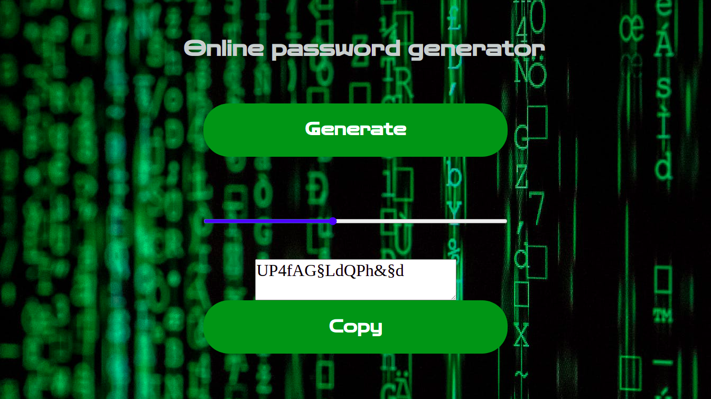

# Password Generator App

**From assignment to application**

Create a repo for this app. we are coming later to it :)
Create a program that generate a random password with the length of 30 character,
every time you call the function should give you a different password.

Examples you will have other passwords for sure.

passwordGen() ➞ Y3mI9x7bvPY86T?oM§hIbgh!MLwA77N
passwordGen() ➞ Oy$tkBGoo5fg§mO4AdV&Kh8XXZR4d7K
passwordGen() ➞ v0ZwDrn@hfI€kOKWH§k6kqub6zfpuyP

[**Password Generator**](https://iuliansta.github.io/passGen/)

## Table of Contents

### About The Project

**Password generator**

We had a JavaScript assignment to build a password generator function.
The assignment transformed into a Frontend application.

-Features added:

- Sass layout;
- Responsive design;
- Slider, the user can change the length of the password between 4 and 30 characters.
- Copy to clipboard button.

- Built With
  - HTML;
  - SCSS;
  - JavaScript;
  - gh-pages;
  - npm live-server.

### Getting Started

- Prerequisites
  - vsCode;
  - node modules;
  - package JSON.
- Installation
  - development tools:
    - node modules;
    - package.json;
    - package-lock.json;
    - gh-pages;
    - sass;
    - live-server.

### Usage

- HTML;
- SCSS;
- JavaScript;
- Google fonts.

### Contributing

## Iulian Stan

### License

- Copyright protected

### Contact

[**Iulian Stan**](https://github.com/iulianSta)

### Acknowledgement

### I want to thank to the [**DCI**](https://www.digitalcareerinstitute.org) team and teachers!
